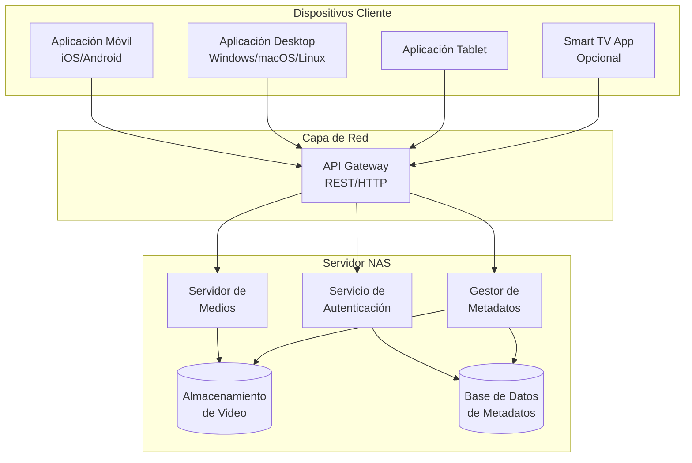
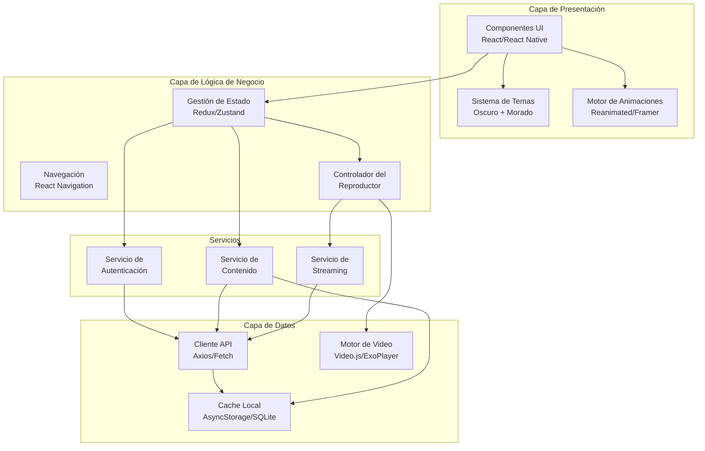
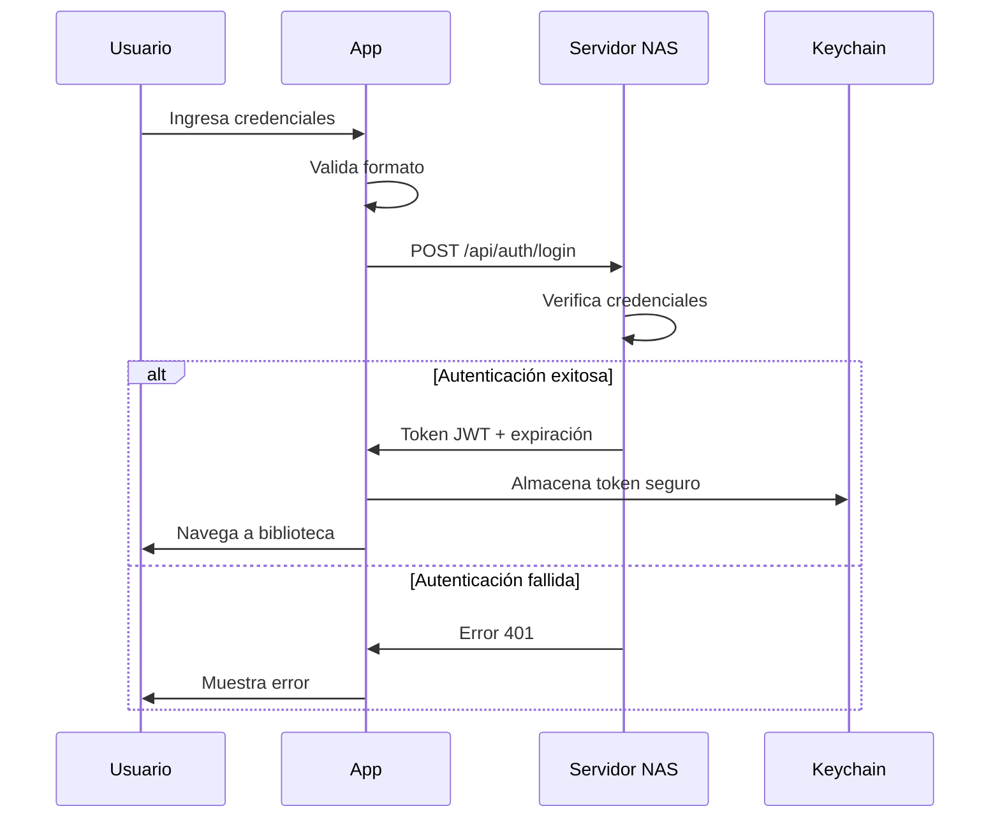
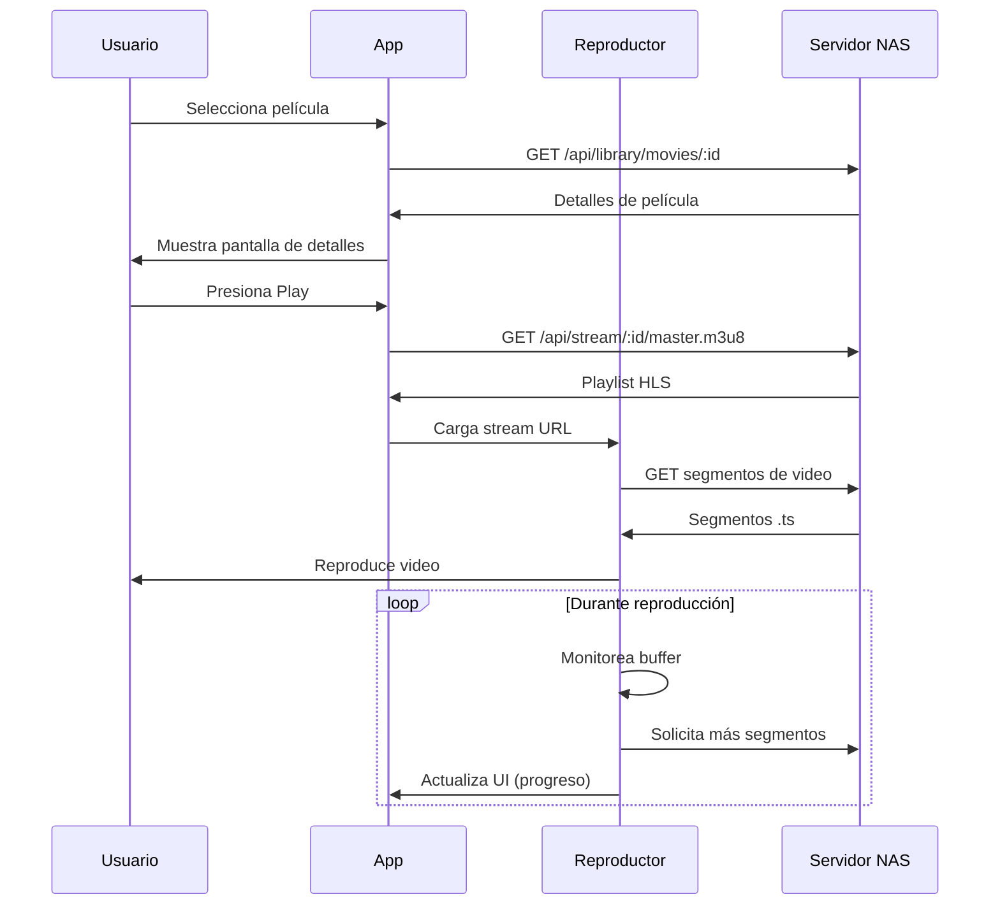
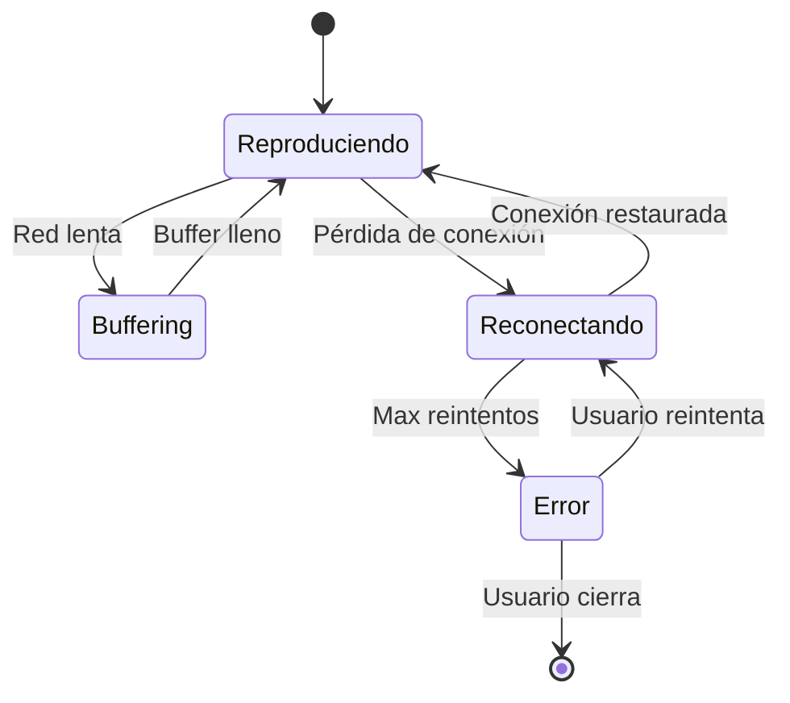

# Documento de Diseño Técnico - BeeFlix

## Introducción

Este documento describe el diseño técnico de BeeFlix, una aplicación de streaming personalizada para películas animadas. El diseño aborda los requisitos funcionales definidos en requirements.md y proporciona una arquitectura escalable, mantenible y de alto rendimiento para múltiples plataformas.

## Visión General

BeeFlix es una aplicación cliente-servidor que permite a los usuarios transmitir contenido de video desde un servidor NAS personal. La arquitectura sigue un patrón de separación cliente-servidor donde:

- **Cliente (BeeFlix App)**: Aplicación multi-plataforma que proporciona la interfaz de usuario y el reproductor de video
- **Servidor (NAS)**: Almacena el contenido de video, metadatos y sirve streams de video a los clientes

El sistema está diseñado para proporcionar una experiencia fluida similar a Netflix con un tema visual oscuro y acentos amarillos/naranjas (temática de abeja), optimizado para diferentes tamaños de pantalla y capacidades de dispositivos.

## Diseño Visual Implementado (Prototipo Web)

### Características Visuales Principales

**Tema de Colores:**
- Fondo principal: Negro oscuro (#141414)
- Acentos: Amarillo/Naranja (#FFA500, #FFB84D, #FF8C00) - temática de abeja
- Textos: Blanco (#ffffff) con grises para secundarios (#b3b3b3)

**Banner Hero:**
- Altura: 80vh con imagen de fondo de película (imágenes hero de alta resolución)
- Degradado oscuro (izquierda a derecha) para mejorar legibilidad del texto
- Rotación automática cada 5 segundos con animación de fundido (fade-in 1s)
- Contenido: título, año, duración, puntuación (estrellas), descripción
- Botones: "Reproducir" (blanco, funcional) y "Más información" (gris translúcido)
- Text-shadow fuerte en título y descripción para legibilidad sobre fondos claros
- Reproducción funcional de películas al hacer clic en "Reproducir"

**Cuadrícula de Películas:**
- Miniaturas horizontales (16:9 aspect ratio)
- Espaciado: 0.5rem horizontal, 2.5rem vertical entre filas
- Información oculta por defecto, visible solo al hover
- Animación hover: escala 1.3, z-index elevado, transición 300ms
- Degradado suave al hover: rgba(0, 0, 0, 0.75) para mejor legibilidad
- Información al hover: título, año, duración, estrellas, botones de acción
- Botón play funcional que abre reproductor de video

**Reproductor de Video:**
- Overlay en pantalla completa con fondo oscuro (rgba 0.95)
- Elemento HTML5 video con controles nativos
- Botón de cerrar (✕) en esquina superior derecha
- Cierre con tecla ESC
- Reproducción automática al abrir
- Diseño responsivo para móviles y tablets
- Soporte para archivos MP4 locales

**Header:**
- Fijo en la parte superior con degradado transparente
- Logo "🐝 BeeFlix" con gradiente amarillo/naranja
- Navegación: Inicio, Películas, Mi Lista
- Búsqueda: icono de lupa en esquina superior derecha

**Márgenes:**
- Estilo Netflix: 4% padding lateral en desktop
- 3% padding en móviles (< 768px)
- Aplicado consistentemente en header, hero y contenido

**Sistema de Puntuación:**
- Estrellas de 1 a 5 con color naranja (#FFA500)
- Estrellas vacías en gris (#808080)
- Visible en hero banner y tarjetas de películas al hover

**Animaciones:**
- Transiciones suaves: 300ms cubic-bezier(0.4, 0, 0.2, 1)
- Fade-in del hero banner: 1s ease-in-out
- Hover en tarjetas: escala y fade-in de información
- Spinner de carga con rotación continua

## Arquitectura

### Arquitectura de Alto Nivel



### Arquitectura del Cliente



### Flujo de Datos

1. **Autenticación**: Usuario ingresa credenciales → Cliente envía a NAS → NAS valida → Retorna token JWT → Cliente almacena token
2. **Descubrimiento de Contenido**: Cliente solicita biblioteca → NAS retorna metadatos → Cliente cachea y muestra en cuadrícula
3. **Reproducción**: Usuario selecciona película → Cliente solicita URL de stream → NAS retorna URL HLS/DASH → Reproductor inicia streaming
4. **Buffering Adaptativo**: Reproductor monitorea ancho de banda → Ajusta calidad de stream → Mantiene reproducción fluida

## Componentes e Interfaces

### 1. Aplicación Cliente (BeeFlix App)

#### 1.1 Stack Tecnológico

**Opción Recomendada: React Native + Expo**
- **Móvil/Tablet**: React Native con Expo para iOS y Android
- **Desktop**: Electron con React o aplicación web progresiva (PWA)
- **TV**: React Native TV (opcional, fase futura)

**Justificación**:
- Máxima reutilización de código entre plataformas (70-80%)
- Ecosistema maduro con bibliotecas de video robustas
- Excelente soporte para animaciones y temas personalizados
- Comunidad activa y documentación extensa

#### 1.2 Módulos Principales

**Nota sobre Prototipo Visual:** El prototipo web actual (index.html, styles.css, app.js) implementa la interfaz visual completa con todas las características de diseño especificadas. Este prototipo sirve como referencia visual para la implementación en React Native.

**AuthenticationModule**
```typescript
interface AuthenticationModule {
  login(serverUrl: string, credentials: Credentials): Promise<AuthToken>;
  logout(): Promise<void>;
  validateToken(token: AuthToken): Promise<boolean>;
  refreshToken(token: AuthToken): Promise<AuthToken>;
  storeCredentials(credentials: Credentials): Promise<void>;
}
```

**ContentDiscoveryModule**
```typescript
interface ContentDiscoveryModule {
  fetchLibrary(): Promise<MovieMetadata[]>;
  fetchMovieDetails(movieId: string): Promise<MovieDetails>;
  searchMovies(query: string): Promise<MovieMetadata[]>;
  cacheMetadata(metadata: MovieMetadata[]): Promise<void>;
  loadCachedMetadata(): Promise<MovieMetadata[]>;
}
```

**VideoPlayerModule**
```typescript
interface VideoPlayerModule {
  loadVideo(streamUrl: string): Promise<void>;
  play(): void;
  pause(): void;
  seek(position: number): void;
  setVolume(level: number): void;
  enterFullscreen(): void;
  exitFullscreen(): void;
  getPlaybackState(): PlaybackState;
  addEventListener(event: PlayerEvent, callback: Function): void;
}
```

**NetworkModule**
```typescript
interface NetworkModule {
  checkConnection(): Promise<ConnectionStatus>;
  monitorConnection(callback: (status: ConnectionStatus) => void): void;
  testServerReachability(serverUrl: string): Promise<boolean>;
  measureBandwidth(): Promise<number>;
}
```

**ConfigurationModule**
```typescript
interface ConfigurationModule {
  saveServerConfig(config: ServerConfig): Promise<void>;
  loadServerConfig(): Promise<ServerConfig>;
  validateServerConfig(config: ServerConfig): Promise<ValidationResult>;
  clearConfig(): Promise<void>;
}
```

### 2. Servidor NAS

#### 2.1 Opciones de Implementación

**Opción A: Servidor Personalizado (Node.js + Express)**
- Control total sobre la implementación
- Ligero y eficiente
- Requiere desarrollo personalizado

**Opción B: Jellyfin (Recomendado)**
- Servidor de medios open-source completo
- API REST bien documentada
- Transcoding automático
- Gestión de metadatos integrada
- Soporte para múltiples formatos

**Opción C: Plex Media Server**
- Solución comercial madura
- Excelente transcoding
- Requiere suscripción para algunas funciones

**Recomendación**: Jellyfin para máxima flexibilidad y control sin costos de licencia.

#### 2.2 API Endpoints

**Autenticación**
```
POST /api/auth/login
Body: { username, password }
Response: { token, expiresIn, userId }

POST /api/auth/refresh
Headers: { Authorization: Bearer <token> }
Response: { token, expiresIn }

POST /api/auth/logout
Headers: { Authorization: Bearer <token> }
Response: { success: true }
```

**Biblioteca de Contenido**
```
GET /api/library/movies
Headers: { Authorization: Bearer <token> }
Query: { page, limit, sortBy }
Response: { movies: MovieMetadata[], total, page, totalPages }

GET /api/library/movies/:id
Headers: { Authorization: Bearer <token> }
Response: MovieDetails

GET /api/library/movies/:id/thumbnail
Headers: { Authorization: Bearer <token> }
Response: Image (JPEG/PNG)
```

**Streaming**
```
GET /api/stream/:movieId/master.m3u8
Headers: { Authorization: Bearer <token> }
Response: HLS Master Playlist

GET /api/stream/:movieId/:quality/stream.m3u8
Headers: { Authorization: Bearer <token> }
Response: HLS Media Playlist

GET /api/stream/:movieId/:quality/segment-:number.ts
Headers: { Authorization: Bearer <token> }
Response: Video Segment
```

### 3. Protocolo de Streaming

**HLS (HTTP Live Streaming) - Recomendado**

Ventajas:
- Amplio soporte en navegadores y dispositivos
- Streaming adaptativo nativo
- Segmentación eficiente
- Compatible con CDNs

Estructura:
```
/stream/
  ├── movie-123/
  │   ├── master.m3u8          # Playlist maestro
  │   ├── 720p/
  │   │   ├── stream.m3u8      # Playlist de calidad
  │   │   ├── segment-0.ts
  │   │   ├── segment-1.ts
  │   │   └── ...
  │   ├── 480p/
  │   │   └── ...
  │   └── 360p/
  │       └── ...
```

Configuración de Calidades:
- **1080p**: 5 Mbps (alta calidad, WiFi)
- **720p**: 2.5 Mbps (calidad media, WiFi/4G)
- **480p**: 1 Mbps (calidad baja, 3G/4G)
- **360p**: 500 Kbps (calidad mínima, conexión lenta)

## Modelos de Datos

### Cliente (TypeScript)

```typescript
interface ServerConfig {
  serverUrl: string;
  port: number;
  useHttps: boolean;
  username: string;
  // password se almacena en keychain/keystore seguro
}

interface AuthToken {
  token: string;
  expiresAt: number;
  userId: string;
}

interface MovieMetadata {
  id: string;
  title: string;
  thumbnailUrl: string;
  duration: number; // en segundos
  year?: number;
  rating?: number;
  genres?: string[];
}

interface MovieDetails extends MovieMetadata {
  description: string;
  director?: string;
  cast?: string[];
  releaseDate?: string;
  fileSize: number;
  resolution: string;
  codec: string;
  audioTracks: AudioTrack[];
  subtitleTracks: SubtitleTrack[];
}

interface AudioTrack {
  id: string;
  language: string;
  codec: string;
  channels: number;
}

interface SubtitleTrack {
  id: string;
  language: string;
  format: string;
}

interface PlaybackState {
  isPlaying: boolean;
  currentTime: number;
  duration: number;
  buffered: TimeRange[];
  volume: number;
  isFullscreen: boolean;
  currentQuality: string;
  availableQualities: string[];
}

interface ConnectionStatus {
  isConnected: boolean;
  connectionType: 'wifi' | 'cellular' | 'ethernet' | 'none';
  bandwidth: number; // Mbps
}
```

### Servidor (Base de Datos)

```sql
-- Tabla de usuarios
CREATE TABLE users (
  id TEXT PRIMARY KEY,
  username TEXT UNIQUE NOT NULL,
  password_hash TEXT NOT NULL,
  created_at TIMESTAMP DEFAULT CURRENT_TIMESTAMP,
  last_login TIMESTAMP
);

-- Tabla de películas
CREATE TABLE movies (
  id TEXT PRIMARY KEY,
  title TEXT NOT NULL,
  file_path TEXT NOT NULL,
  thumbnail_path TEXT,
  duration INTEGER, -- segundos
  file_size INTEGER, -- bytes
  resolution TEXT,
  codec TEXT,
  year INTEGER,
  rating REAL,
  description TEXT,
  director TEXT,
  release_date TEXT,
  created_at TIMESTAMP DEFAULT CURRENT_TIMESTAMP,
  updated_at TIMESTAMP DEFAULT CURRENT_TIMESTAMP
);

-- Tabla de géneros
CREATE TABLE genres (
  id TEXT PRIMARY KEY,
  name TEXT UNIQUE NOT NULL
);

-- Tabla de relación película-género
CREATE TABLE movie_genres (
  movie_id TEXT REFERENCES movies(id),
  genre_id TEXT REFERENCES genres(id),
  PRIMARY KEY (movie_id, genre_id)
);

-- Tabla de pistas de audio
CREATE TABLE audio_tracks (
  id TEXT PRIMARY KEY,
  movie_id TEXT REFERENCES movies(id),
  language TEXT,
  codec TEXT,
  channels INTEGER
);

-- Tabla de pistas de subtítulos
CREATE TABLE subtitle_tracks (
  id TEXT PRIMARY KEY,
  movie_id TEXT REFERENCES movies(id),
  language TEXT,
  format TEXT,
  file_path TEXT
);

-- Tabla de sesiones (tokens)
CREATE TABLE sessions (
  token TEXT PRIMARY KEY,
  user_id TEXT REFERENCES users(id),
  expires_at TIMESTAMP NOT NULL,
  created_at TIMESTAMP DEFAULT CURRENT_TIMESTAMP
);

-- Índices para optimización
CREATE INDEX idx_movies_title ON movies(title);
CREATE INDEX idx_sessions_user ON sessions(user_id);
CREATE INDEX idx_sessions_expires ON sessions(expires_at);
```


## Propiedades de Corrección

*Una propiedad es una característica o comportamiento que debe ser verdadero en todas las ejecuciones válidas de un sistema - esencialmente, una declaración formal sobre lo que el sistema debe hacer. Las propiedades sirven como puente entre las especificaciones legibles por humanos y las garantías de corrección verificables por máquinas.*

### Propiedad 1: Autenticación con credenciales válidas

*Para cualquier* conjunto de credenciales válidas (nombre de usuario y contraseña) y dirección de servidor válida, cuando la aplicación intente autenticarse, el módulo de autenticación debe enviar una solicitud HTTP con las credenciales correctamente formateadas en el cuerpo de la petición.

**Valida: Requisitos 1.1, 1.3**

### Propiedad 2: Recuperación y renderizado completo de metadatos

*Para cualquier* conjunto de películas retornado por el servidor, la aplicación debe mostrar todos los metadatos requeridos (título, miniatura, duración) para cada película en la interfaz de usuario.

**Valida: Requisitos 2.1, 2.2, 7.2, 7.5**

### Propiedad 3: Navegación a detalles de película

*Para cualquier* película seleccionada de la biblioteca, la aplicación debe navegar a una pantalla de detalles que muestre información completa sobre esa película específica.

**Valida: Requisitos 2.5**

### Propiedad 4: Inicio de streaming al seleccionar película

*Para cualquier* película válida seleccionada, el reproductor multimedia debe iniciar una solicitud de streaming al servidor NAS con el ID correcto de la película.

**Valida: Requisitos 3.1**

### Propiedad 5: Pausa y reanudación preserva estado

*Para cualquier* estado de reproducción activo, pausar el video y luego reanudarlo debe mantener la posición de reproducción actual (con una tolerancia de ±1 segundo debido a buffering).

**Valida: Requisitos 3.3**

### Propiedad 6: Seek a cualquier posición válida

*Para cualquier* posición válida dentro de la duración del video (0 ≤ posición ≤ duración), el reproductor debe poder hacer seek a esa posición, ya sea mediante la API programática o mediante interacción con la barra de progreso.

**Valida: Requisitos 3.4, 6.5**

### Propiedad 7: Modo pantalla completa

*Para cualquier* estado de reproducción, activar el modo de pantalla completa debe cambiar el estado del reproductor a fullscreen=true, y desactivarlo debe retornar a fullscreen=false.

**Valida: Requisitos 3.6**

### Propiedad 8: Adaptación responsiva a tamaños de pantalla

*Para cualquier* tamaño de pantalla válido (ancho y alto en píxeles), la interfaz de usuario debe ajustar su layout sin elementos superpuestos o cortados, manteniendo todos los componentes visibles y accesibles.

**Valida: Requisitos 4.5**

### Propiedad 9: Información de reproducción completa

*Para cualquier* video en reproducción, la interfaz del reproductor debe mostrar simultáneamente: posición actual, duración total, y progreso visual en la barra de progreso, con todos los valores sincronizados.

**Valida: Requisitos 6.2, 6.3**

### Propiedad 10: Mostrar controles en interacción

*Para cualquier* evento de interacción del usuario (movimiento de mouse, toque en pantalla, tecla presionada), los controles del reproductor deben volverse visibles si estaban ocultos.

**Valida: Requisitos 6.7**

### Propiedad 11: Ordenamiento alfabético de biblioteca

*Para cualquier* conjunto de películas en la biblioteca, cuando se aplique el ordenamiento por defecto, las películas deben aparecer en orden alfabético ascendente por título (ignorando mayúsculas/minúsculas y artículos como "El", "La", "Los", "Las").

**Valida: Requisitos 7.4**

### Propiedad 12: Registro de errores

*Para cualquier* error que ocurra en la aplicación (error de red, error de reproducción, error de autenticación), debe existir una entrada correspondiente en el sistema de logging con al menos: timestamp, tipo de error, y mensaje descriptivo.

**Valida: Requisitos 8.5**

### Propiedad 13: Buffer mínimo adelantado

*Para cualquier* video en reproducción activa con conexión de red estable, el reproductor debe mantener al menos 10 segundos de contenido en buffer adelante de la posición actual de reproducción.

**Valida: Requisitos 9.4**

### Propiedad 14: Ajuste adaptativo de calidad

*Para cualquier* ancho de banda de red medido, el reproductor debe seleccionar la calidad de streaming más alta que pueda mantenerse sin buffering (≤ 80% del ancho de banda disponible), y cambiar a una calidad inferior si el buffer comienza a agotarse.

**Valida: Requisitos 9.5**

### Propiedad 15: Persistencia de configuración round-trip

*Para cualquier* configuración válida del servidor (dirección, puerto, credenciales), guardar la configuración y luego cargarla debe retornar valores equivalentes, con las credenciales almacenadas de forma segura en el keychain/keystore del sistema.

**Valida: Requisitos 10.2, 10.3, 10.5**

### Propiedad 16: Validación al guardar configuración

*Para cualquier* configuración de servidor que se intente guardar, la aplicación debe realizar una prueba de conexión al servidor antes de confirmar el guardado, y solo persistir la configuración si la validación es exitosa.

**Valida: Requisitos 10.4**

## Manejo de Errores

### Estrategia General

La aplicación implementa un sistema de manejo de errores en capas:

1. **Capa de Red**: Captura errores de conectividad, timeouts, y respuestas HTTP inválidas
2. **Capa de Negocio**: Valida datos y maneja errores de lógica de aplicación
3. **Capa de Presentación**: Muestra mensajes de error amigables al usuario

### Tipos de Errores y Respuestas

**Errores de Conexión**
- **Servidor no alcanzable**: "No se puede conectar al servidor. Verifica tu conexión de red y la dirección del servidor."
- **Timeout**: "La conexión tardó demasiado. Verifica tu conexión de red."
- **SSL/TLS error**: "Error de seguridad en la conexión. Verifica la configuración HTTPS."

**Errores de Autenticación**
- **Credenciales inválidas**: "Usuario o contraseña incorrectos. Intenta nuevamente."
- **Token expirado**: Renovar automáticamente el token, o redirigir a login si falla
- **Sin autorización**: "No tienes permisos para acceder a este contenido."

**Errores de Reproducción**
- **Archivo no encontrado**: "Esta película no está disponible. Puede haber sido movida o eliminada."
- **Formato no soportado**: "Este formato de video no es compatible. Contacta al administrador."
- **Error de decodificación**: "Error al reproducir el video. Intenta nuevamente o selecciona otra película."
- **Pérdida de conexión durante reproducción**: "Conexión perdida. Reconectando..." (con reintentos automáticos)

**Errores de Datos**
- **Metadatos inválidos**: Usar valores por defecto y registrar el error
- **Miniatura no disponible**: Mostrar imagen placeholder
- **Respuesta JSON malformada**: "Error al cargar el contenido. Intenta nuevamente."

### Estrategia de Reintentos

```typescript
interface RetryConfig {
  maxAttempts: number;
  initialDelay: number; // ms
  maxDelay: number; // ms
  backoffMultiplier: number;
}

// Configuración por tipo de operación
const retryConfigs = {
  authentication: { maxAttempts: 3, initialDelay: 1000, maxDelay: 5000, backoffMultiplier: 2 },
  contentFetch: { maxAttempts: 3, initialDelay: 500, maxDelay: 3000, backoffMultiplier: 1.5 },
  streaming: { maxAttempts: 5, initialDelay: 2000, maxDelay: 10000, backoffMultiplier: 2 },
  thumbnails: { maxAttempts: 2, initialDelay: 1000, maxDelay: 2000, backoffMultiplier: 1 }
};
```

### Logging

Todos los errores se registran con la siguiente estructura:

```typescript
interface ErrorLog {
  timestamp: string; // ISO 8601
  level: 'error' | 'warning' | 'info';
  category: 'network' | 'auth' | 'playback' | 'data' | 'ui';
  message: string;
  details?: any;
  stackTrace?: string;
  userId?: string;
  deviceInfo: {
    platform: string;
    osVersion: string;
    appVersion: string;
  };
}
```

Los logs se almacenan localmente y pueden exportarse para diagnóstico.

## Estrategia de Testing

### Enfoque Dual: Unit Tests + Property-Based Tests

La estrategia de testing de BeeFlix combina dos enfoques complementarios:

1. **Unit Tests**: Verifican ejemplos específicos, casos edge, y condiciones de error
2. **Property-Based Tests**: Verifican propiedades universales a través de múltiples entradas generadas

Ambos son necesarios para cobertura completa: los unit tests capturan bugs concretos y casos específicos, mientras que los property tests verifican corrección general a través de muchas variaciones de entrada.

### Biblioteca de Property-Based Testing

**Para JavaScript/TypeScript: fast-check**

```bash
npm install --save-dev fast-check @types/fast-check
```

Justificación:
- Biblioteca madura y bien mantenida
- Excelente integración con Jest y otros frameworks
- Generadores ricos para tipos complejos
- Shrinking automático para encontrar casos mínimos de fallo

### Configuración de Property Tests

Cada property test debe:
- Ejecutarse con mínimo 100 iteraciones (configurar `numRuns: 100`)
- Incluir un comentario de etiqueta referenciando la propiedad del diseño
- Usar generadores apropiados para el dominio de datos

Formato de etiqueta:
```typescript
// Feature: abejita-streaming-app, Property 1: Autenticación con credenciales válidas
```

### Ejemplos de Property Tests

**Propiedad 1: Autenticación**
```typescript
import fc from 'fast-check';

// Feature: abejita-streaming-app, Property 1: Autenticación con credenciales válidas
describe('Authentication Module', () => {
  it('should send properly formatted auth request for any valid credentials', () => {
    fc.assert(
      fc.property(
        fc.record({
          username: fc.string({ minLength: 1, maxLength: 50 }),
          password: fc.string({ minLength: 1, maxLength: 100 }),
          serverUrl: fc.webUrl()
        }),
        async (credentials) => {
          const mockFetch = jest.fn().mockResolvedValue({
            ok: true,
            json: async () => ({ token: 'mock-token' })
          });
          
          const authModule = new AuthenticationModule(mockFetch);
          await authModule.login(credentials.serverUrl, {
            username: credentials.username,
            password: credentials.password
          });
          
          expect(mockFetch).toHaveBeenCalledWith(
            expect.stringContaining('/api/auth/login'),
            expect.objectContaining({
              method: 'POST',
              body: expect.stringContaining(credentials.username)
            })
          );
        }
      ),
      { numRuns: 100 }
    );
  });
});
```

**Propiedad 11: Ordenamiento Alfabético**
```typescript
// Feature: abejita-streaming-app, Property 11: Ordenamiento alfabético de biblioteca
describe('Content Organization', () => {
  it('should sort any movie collection alphabetically by title', () => {
    fc.assert(
      fc.property(
        fc.array(
          fc.record({
            id: fc.uuid(),
            title: fc.string({ minLength: 1, maxLength: 100 }),
            duration: fc.integer({ min: 60, max: 18000 })
          }),
          { minLength: 0, maxLength: 100 }
        ),
        (movies) => {
          const sorted = sortMoviesAlphabetically(movies);
          
          // Verificar que está ordenado
          for (let i = 0; i < sorted.length - 1; i++) {
            const current = normalizeTitle(sorted[i].title);
            const next = normalizeTitle(sorted[i + 1].title);
            expect(current.localeCompare(next)).toBeLessThanOrEqual(0);
          }
          
          // Verificar que contiene los mismos elementos
          expect(sorted).toHaveLength(movies.length);
          expect(new Set(sorted.map(m => m.id))).toEqual(new Set(movies.map(m => m.id)));
        }
      ),
      { numRuns: 100 }
    );
  });
});
```

**Propiedad 15: Persistencia Round-Trip**
```typescript
// Feature: abejita-streaming-app, Property 15: Persistencia de configuración round-trip
describe('Configuration Module', () => {
  it('should persist and retrieve any valid server configuration', () => {
    fc.assert(
      fc.property(
        fc.record({
          serverUrl: fc.webUrl(),
          port: fc.integer({ min: 1, max: 65535 }),
          useHttps: fc.boolean(),
          username: fc.string({ minLength: 1, maxLength: 50 })
        }),
        async (config) => {
          const configModule = new ConfigurationModule();
          
          // Guardar configuración
          await configModule.saveServerConfig(config);
          
          // Cargar configuración
          const loaded = await configModule.loadServerConfig();
          
          // Verificar equivalencia
          expect(loaded.serverUrl).toBe(config.serverUrl);
          expect(loaded.port).toBe(config.port);
          expect(loaded.useHttps).toBe(config.useHttps);
          expect(loaded.username).toBe(config.username);
        }
      ),
      { numRuns: 100 }
    );
  });
});
```

### Unit Tests para Casos Específicos

Los unit tests deben enfocarse en:

**Casos Edge Identificados**:
- Servidor no alcanzable (1.2)
- Autenticación fallida (1.4)
- Pérdida de conectividad durante reproducción (3.5, 8.2)
- Archivo de video corrupto o no soportado (8.1, 8.3)
- Biblioteca con más de 20 películas - paginación (7.3)

**Ejemplos Específicos**:
- Presencia de controles de reproducción (6.1)
- Presencia de controles de volumen (6.4)
- Pantalla de configuración existe (10.1)

**Integración entre Componentes**:
- Flujo completo de autenticación → carga de biblioteca → reproducción
- Manejo de token expirado durante navegación
- Sincronización entre UI y estado del reproductor

### Cobertura de Testing

Objetivos de cobertura:
- **Módulos de lógica de negocio**: 90%+ cobertura de líneas
- **Componentes UI**: 70%+ cobertura (enfoque en lógica, no en estilos)
- **Servicios de red**: 85%+ cobertura
- **Utilidades y helpers**: 95%+ cobertura

### Testing por Plataforma

**Móvil (React Native)**:
- Jest para unit y property tests
- React Native Testing Library para componentes
- Detox para E2E tests (opcional)

**Desktop/Web**:
- Jest para unit y property tests
- React Testing Library para componentes
- Cypress o Playwright para E2E tests (opcional)

### Continuous Integration

Los tests deben ejecutarse en CI/CD:
- En cada push a ramas de desarrollo
- Antes de merge a main/master
- Property tests con 100 iteraciones en CI, 1000 en nightly builds

## Consideraciones de Seguridad

### Almacenamiento de Credenciales

**Móvil**:
- iOS: Keychain Services
- Android: Android Keystore System

**Desktop**:
- Windows: Windows Credential Manager
- macOS: Keychain
- Linux: libsecret / gnome-keyring

**Nunca** almacenar credenciales en:
- AsyncStorage sin encriptar
- LocalStorage
- Archivos de configuración en texto plano

### Comunicación con el Servidor

- **HTTPS obligatorio** para producción
- Validación de certificados SSL/TLS
- Pinning de certificados (opcional, para mayor seguridad)
- Tokens JWT con expiración corta (1-2 horas)
- Refresh tokens con expiración más larga (7-30 días)

### Validación de Entrada

Todas las entradas del usuario deben validarse:
- Dirección de servidor: formato URL válido
- Puerto: rango 1-65535
- Credenciales: longitud mínima/máxima, caracteres permitidos

### Protección contra Ataques

- **Rate limiting**: Limitar intentos de autenticación (3-5 por minuto)
- **Timeout**: Configurar timeouts apropiados para requests (30s para auth, 10s para API)
- **Sanitización**: Escapar caracteres especiales en búsquedas y filtros

## Consideraciones de Rendimiento

### Optimización de Carga de Miniaturas

- **Lazy loading**: Cargar miniaturas solo cuando sean visibles
- **Tamaños múltiples**: Servidor debe proveer thumbnails en varios tamaños (small: 200x300, medium: 400x600)
- **Caching**: Cachear miniaturas en disco con política LRU (Least Recently Used)
- **Formato**: Preferir WebP sobre JPEG/PNG (50-70% menor tamaño)

### Optimización de Streaming

- **Precarga**: Precargar los primeros 2-3 segundos antes de mostrar el reproductor
- **Buffer adaptativo**: Ajustar tamaño de buffer según ancho de banda
- **Calidad inicial**: Comenzar con calidad media, luego ajustar
- **Segmentos cortos**: Usar segmentos de 2-4 segundos para cambios rápidos de calidad

### Gestión de Memoria

- **Límite de cache**: Máximo 500MB para miniaturas, 100MB para metadatos
- **Limpieza periódica**: Limpiar cache cada 7 días o cuando se alcance el límite
- **Liberación de recursos**: Liberar reproductor de video cuando no esté en uso

### Optimización de UI

- **Virtualización**: Usar listas virtualizadas (FlatList en React Native) para grandes bibliotecas
- **Debouncing**: Aplicar debounce a búsquedas (300ms)
- **Throttling**: Aplicar throttle a eventos de scroll (16ms para 60fps)
- **Memoización**: Memoizar componentes pesados que no cambian frecuentemente

## Plan de Implementación

### Fase 1: MVP (Minimum Viable Product)

**Duración estimada**: 4-6 semanas

Funcionalidades:
- Autenticación básica con servidor NAS
- Listado de películas con miniaturas
- Reproducción de video básica (play/pause/seek)
- Configuración de servidor
- Soporte para móvil (iOS/Android) y web

### Fase 2: Mejoras de UX

**Duración estimada**: 3-4 semanas

Funcionalidades:
- Tema oscuro con acentos morados
- Animaciones de transición
- Pantalla de detalles de película
- Controles de reproducción completos
- Manejo de errores mejorado

### Fase 3: Optimización y Multi-plataforma

**Duración estimada**: 3-4 semanas

Funcionalidades:
- Aplicación desktop (Electron)
- Streaming adaptativo (HLS)
- Optimización de rendimiento
- Caching inteligente
- Testing completo (unit + property tests)

### Fase 4: Características Avanzadas (Opcional)

**Duración estimada**: 4-6 semanas

Funcionalidades:
- Soporte para Smart TV
- Subtítulos y múltiples pistas de audio
- Listas de reproducción
- Historial de visualización
- Recomendaciones

## Dependencias y Tecnologías

### Frontend (React Native + Expo)

```json
{
  "dependencies": {
    "react": "^18.2.0",
    "react-native": "^0.72.0",
    "expo": "^49.0.0",
    "expo-av": "^13.4.0",
    "expo-secure-store": "^12.3.0",
    "react-navigation": "^6.1.0",
    "@react-navigation/native": "^6.1.0",
    "@react-navigation/stack": "^6.3.0",
    "axios": "^1.4.0",
    "zustand": "^4.3.0",
    "react-native-reanimated": "^3.3.0",
    "react-native-gesture-handler": "^2.12.0"
  },
  "devDependencies": {
    "@testing-library/react-native": "^12.1.0",
    "jest": "^29.5.0",
    "fast-check": "^3.10.0",
    "@types/jest": "^29.5.0",
    "@types/react": "^18.2.0",
    "@types/react-native": "^0.72.0"
  }
}
```

### Backend (Jellyfin)

- **Jellyfin Server**: v10.8+ (open-source media server)
- **FFmpeg**: Para transcoding de video
- **SQLite**: Base de datos de metadatos

Alternativa: Servidor Node.js personalizado con:
- Express.js
- Fluent-ffmpeg para transcoding
- SQLite3 o PostgreSQL

## Diagramas Adicionales

### Flujo de Autenticación



### Flujo de Reproducción



### Flujo de Manejo de Errores de Red



## Conclusión

Este diseño proporciona una arquitectura sólida y escalable para BeeFlix, balanceando funcionalidad, rendimiento y experiencia de usuario. La separación clara de responsabilidades entre módulos facilita el mantenimiento y la extensión futura. El enfoque en property-based testing junto con unit tests tradicionales asegura alta calidad y corrección del software.

Las decisiones técnicas priorizan:
1. **Reutilización de código** mediante React Native
2. **Seguridad** con almacenamiento apropiado de credenciales
3. **Rendimiento** con streaming adaptativo y caching inteligente
4. **Mantenibilidad** con arquitectura modular y testing exhaustivo
5. **Experiencia de usuario** con UI fluida y manejo robusto de errores

El plan de implementación por fases permite entregar valor incremental mientras se construye hacia la visión completa del producto.
